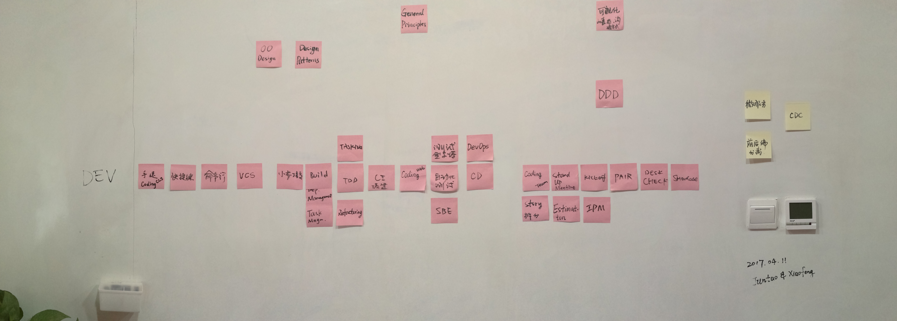

## Just a Dev

2017年4月11日，王晓峰和邱俊涛在西安办公室总结了一些他们认为的，ThoughtWorks的`Dev`（Developer简称，下同）应该具备的技能列表。
这些技能涵盖了日常`Coding`的具体技能到与团队合作的流程，同时还包括了如何与团队中其他成员合作方式的技能。

### 元任务

原技能不局限在后面列出的任何一个单项技能，不过又非常重要，偏重于形而上。

- 通用原则（[SOLID](https://zh.wikipedia.org/wiki/SOLID_(%E9%9D%A2%E5%90%91%E5%AF%B9%E8%B1%A1%E8%AE%BE%E8%AE%A1))原则，[关注点分离](https://zh.wikipedia.org/wiki/%E5%85%B3%E6%B3%A8%E7%82%B9%E5%88%86%E7%A6%BB)）
- 面向对象
- [设计模式](https://zh.wikipedia.org/wiki/%E8%AE%BE%E8%AE%A1%E6%A8%A1%E5%BC%8F)
- [可视化表达（白板笔）与沟通](https://book.douban.com/subject/26587519/)
- [Domain Driven Design](https://en.wikipedia.org/wiki/Domain-driven_design)

### 基础技能

此部分技能包含一个Dev日常开发所需要用到的基础技能，具备这些技能的Dev可以完成日常工作中的`开发`部分任务。

- 快捷键（IDE或者编辑器的快捷键）
- [命令行](http://icodeit.org/2017/01/why-top-programmers-hate-gui/)（Shell及常见*nix命令的使用）
- VCS（Git/SubVersion）
- 小步提交
- Build脚本（依赖管理，任务管理）
- [TDD/Tasking/Refactoring](http://icodeit.org/2014/11/tdd-step-by-step/)
- CI搭建（Build的创建、流水线的创建、环境准备等）

### 进阶技能1

此部分技能属于基础技能的进阶，默认地，Dev在具备了基础技能之后，需要进一步掌握这里列出的技能。

- [测试金字塔](http://icodeit.org/2016/10/testing-in-microservice-context/)
- 自动化测试（Selenium、Webdriver）
- [Specification By Example](https://book.douban.com/subject/11611022/)（BDD）
- DevOps（环境的自动化）
- [持续交付](https://book.douban.com/subject/6862062/)

### 进阶技能2

在具备`基础技能`和`进阶技能1`之后，Dev应该扩展自己的视野，从一个程序员转变成一位能交付客户价值的Team member，这部分更关注
与团队协作，帮助团队建设等方面的能力。

- Story拆分能力
- Standup meeting（如何更新自己的状态）
- [Estimation](https://www.sitepoint.com/3-powerful-estimation-techniques-for-agile-teams/)（对估点方式及效果的认识）
- *Retrospective meeting*（如何发现团队流程方面的问题及如何改进）
- *Feedback*（如何帮助其他人改进）
- Kickoff（注意事项）
- 结对编程
- IPM会议
- *Code Review*（如何有效传递信息）
- Desk check（面向BA，QA，如何准备）
- Showcase（面向客户，如何准备）

### 备注

摄影师：王晓峰
